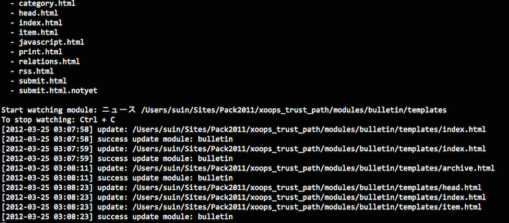

# xoops-watch-template.php



## Install

```
git clone 
```

## Usage

```
usage: watch-template.php <mainfile_path> <module_dirname> <watch_dir>

Template auto-update tool for XOOPS.

positional arguments:
  mainfile_path  : Full path to mainfile.php
  module_dirname : Module directory name
  watch_dir      : Directory to watch

```

